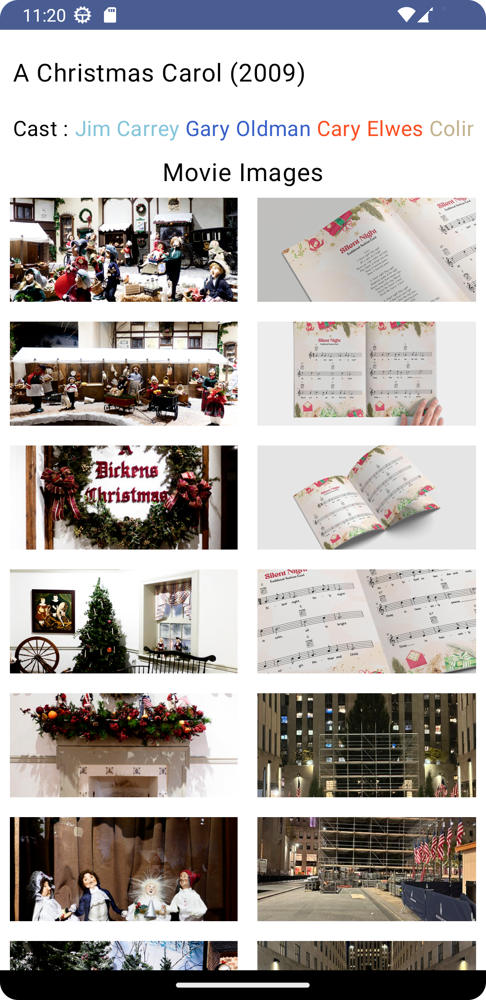

# MovieMaster

 

  

<h3 align="center">Movie Master</h3>

  

    A decade of Movies The Project build with (Compose UI , coroutine ,retrofit ,MVVM Architecture , Flows , Unit Test )
     
     
    <a href="https://github.com/markoeltiger/MovieMaster"><strong>Explore the docs »</strong></a>
     
     
    <a href="https://github.com/markoeltiger/MovieMaster">View Demo</a>
    .
     .
   

 

## Table Of Contents

* [About the Project](#about-the-project)
* [Built With](#built-with)
* [Getting Started](#getting-started)
    * [Prerequisites](#prerequisites)
    * [Installation](#installation)
* [Project Architecture:](#Project Architecture:)
* [Usage](#usage)
* [Roadmap](#roadmap)
* [Contributing](#contributing)
* [License](#license)
* [Authors](#authors)
* [Acknowledgements](#acknowledgements)

## About The Project

A list of commonly used resources that I find helpful are listed in the acknowledgements.

## Built With

The Project build with\
* [Compose UI](Compose UI)
* [coroutine](coroutine)
* [retrofit](retrofit)
* [MVVM](MVVM)
* [FLows](Flows)

## Getting Started

I have Used latest technology tools to implement the project built with MVVM Clean Arch Used Dagger Hilt for injection and Coroutines for threading also retrofit for networking

### Prerequisites

-Android Studio
-Java SDK

## Project Architecture:
This project follows the Clean Architecture structure and MVI. It has UseCases that encapsulate a single, specific task that is part of the application's business logic. Repository layer, providing a single source of truth for data. The UI layer uses all the components and classes related to the Android framework to get the data from the ViewModel layer and display it on the UI.

## Screenshots

     
 

## Usage

Clone The Project
and open it in your android studio it will be helpful if you want  to add some thing new

## License

Distributed under the MIT License. See [LICENSE](https://github.com/markoeltiger/MovieMaster/blob/main/LICENSE.md) for more information.

## Authors

* **Mark Saif** - *Software Engineer* - [Mark Saif](https://github.com/markoeltiger/) - *Build the project*

 